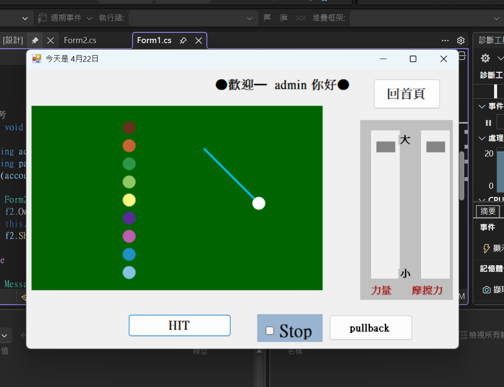
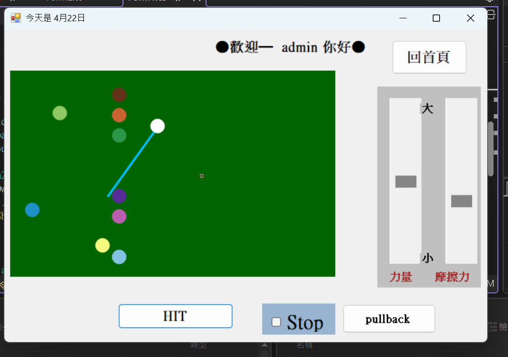
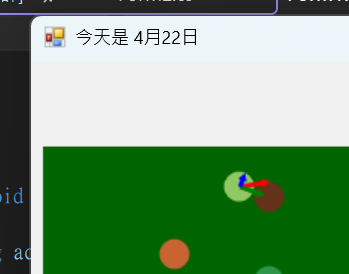

## Billiards Game Side Project (C# Windows Application)
A feature-rich Billiards (Pool) simulation game built with C# and WinForms. This project demonstrates the implementation of custom physics engines, user authentication, and interactive game state management in a desktop environment.

📸 Preview
(Insert your gameplay screenshots here to make your repository stand out!)

## ✨ Key Features
1. User Authentication System
A secure login interface integrated to manage user access.

Default Credentials: * Username: admin

Password: 1234

2. Realistic Physics Engine
Collision Detection: Precise ball-to-ball and ball-to-wall elastic collision logic.

Momentum & Friction: Realistic deceleration and momentum transfer based on physical constants.

Game Rules: Includes scoring systems (pocketing balls) and game-over conditions.

3. Advanced Game Control
Adjustable Power: Use the vertical scrollbar to fine-tune the striking force.

Adjustable Friction: Customize the table's friction levels to simulate different playing surfaces (from professional felt to ice-like surfaces).

Time Freeze (Unique Feature): Ability to pause the physics simulation at any moment after a shot to analyze the ball trajectories.

4. Visual Aids
Trajectory Prediction: Real-time visual lines to help players aim and understand collision angles.

## 🛠️ Tech Stack
Language: C#

Framework: .NET Framework (WinForms)

IDE: Visual Studio

## 🚀 How to Run
Clone this repository:

Bash
git clone https://github.com/your-username/your-repo-name.git
Open the .sln file in Visual Studio.

Build and Run the project (F5).

Log in using the default credentials (admin / 1234).

## 📝 Code Overview
Form1.cs: Handles the login logic and credential validation.

Form2.cs: The core game engine, containing the ball class, collision algorithms, and GDI+ rendering logic.

## 🤝 Contact
Main email : dhkgodez@gmail.com

## 📸 Preview

